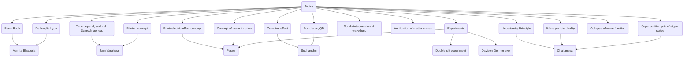

```mermaid
flowchart TD;
topics(Topics)-->Blackbody(Black Body)
topics-->photonconcept(Photon concept)
topics-->photo(Photoelectric effect concept)
topics-->compton(Compton effect)
topics-->broglie(De broglie hypo)
topics-->Experiments(Experiments)
Experiments-->dbe(Double slit experiment)
Experiments-->dge(Davison Germer exp)
topics-->UP(Uncertainity Principle)
topics-->WPD(Wave particle duality)
topics-->bondsGraph(Bonds interpretaion of wave func)
topics-->matterWaveVerification(Verification of matter waves)
topics-->postulates(Postulates, QM)
topics-->waveFn(Concept of wave function)
topics--> eigen(Superposition prin of eigen states)
topics-->collapse(Collapse of wave function)
topics-->schrodinger(Time depend, and ind. Schrodinger eq.)
schrodinger-->sam(Sam Varghese)
Blackbody --> asmita(Asmita Bhadoria)
photonconcept-->sam
broglie-->asmita
photo-->paragi(Paragi)
waveFn-->paragi
compton-->sudhanshu(Sudhanshu)
postulates-->sudhanshu
Experiments-->paragi
UP-->chaitanaya(Chaitanaya)
WPD-->chaitanaya
eigen-->chaitanaya
```

